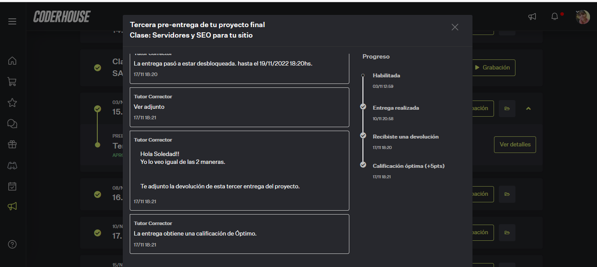

# Tercera Pre-Entrega: consiste en continuar con el proyecto en avance de conceptos aprendidos

### DEMO: https://sole-arguello.github.io/PreEntrega3-ArguelloMariaSoledad/

### Temas Vistos:
    10. @Media+Pseudoclases
    11. SASS
    12. Servidores y SEO para tu sitio
    8. GIT y GITHUB
    9. Frameworks CSS+Bootstrap
    
## Formato:
       
        Archivos .json en carpeta comprimida + link al repositorio en GitHub.  Debe tener 
        el nombre “PreEntrega3+Apellido”.

## Aspectos a incluir:
       - El proyecto completo deberá visibilizarse de manera correcta en dispositivos mobile y desktop. 
       - El mismo deberá estar configurado y con código SASS aplicado. Además, deberán mostrar uso de 
         la correcta aplicación del SEO.  
       - Objetivo:
                  * Realizar la estructura final de la web.
                  * Efectuar el estilo final de la web.
                  * Realizar una correcta implementación de Node modules.
                  * Generar la carga en un repositorio en GitHub.
                  
## Estructura Final de la web:

### Formato: 
      - Archivo HTML 
      - CSS3 (Archivo CSS, Archivos SASS o SCSS (en GitHub)) 
      - Repositorio en GITHUB (link donde esta alojado el proyecto)
      - Node Modules (Archivo package.json y package-lock.json (en carpeta comprimida)).
      - Técnicas SEO

### Consigna:

       - HTML: Realizar una estructura del HTML con buena indentación, espacios prolijos, y comentarios, 
               siendo usados para comentar secciones y no para ocultar código. Agregar elementos HTML 
               según necesidades de armar contenedores o elementos web determinados, a través del código 
               del framework elegido y la documentación del mismo.
         
       - CSS3: Crear archivos de SCSS o SASS para darle estilo a la web:
               * Trasladar los estilos creados en CSS a SCSS, haciendo uso correcto del nesting, los mixins, 
                 las variables y los operadores de lenguaje SASS.
               * Formar un archivo de SCSS con una sintaxis correcta, dónde el código no tenga errores, 
                 ya sea de CSS cómo de compilación.
               * Utilizar SASS para personalizar el framework que estás usando.
               
       - Node Modules: 
            Inicializar npm en el proyecto y configurar el package con los datos pertinentes al mismo:
               * Instalar y agregar las dependencias nodemon y node-sass al proyecto, además de los scripts 
                 necesarios para la compilación de archivos de SASS.
               * En caso de utilizar otro módulo de npm, agregarlo como dependencia al proyecto.

            
       - SEO: Implementar técnicas de SEO como meta tags description, keywords, favicon, completar los alts 
              de las imágenes y utilización de las etiquetas semánticas.      
         
       - GitHub: Utilizar Git de forma correcta para versionar el proyecto. Hacer uso de GitHub para brindar 
                 acceso al proyecto versionado.
                 
### Se debe entregar:

       * Maquetado de la web: 
          -  Las estructuras deben maquetar a la web en base al framework elegido, haciendo usos de clases utilitarias 
             para armar grillas, elementos web y estilos propios del framework, además del HTML de contenido. 
            
       * Páginas: 
          - Todas las páginas deben tener el contenido estructurado y el estilo linkeado. 
          - Agregar las diferentes librerías de JavaScript y CSS pertinentes al framework..
          
       * Estilo avanzado: 
           - Transforma lo que originalmente eran estilos de CSS en SCSS. Utililzar las características de SCSS 
             para armar estilos de CSS de forma dinámica, además del uso de nesting para estructurarlo de forma 
             legible y evitando repetir código.
       * Estructura de la web:
           - Usa etiquetas no solo para armar contenido, sino para armar los elementos que van a conformar 
             el layout de la web, los contenedores, etc.
       
       * Metadatos del proyecto:
          - Archivo package.json con información relevante del proyecto como el nombre y una mínima descripción.
       * Scripts de npm: 
          - Para poder generar los archivos de CSS que va a necesitar luego el sitio web.          
   
       * Repositorio:
           - Enviar al repositorio todos los archivos necesarios para visualizar correctamente la web.
           - Utilizar .gitignore para evitar enviar archivos irrelevantes para la presentación como node_modules.
           - En el repositorio se muestran los commit realizados para actualizar/versionar el código.

### Nota obtenida:

   
